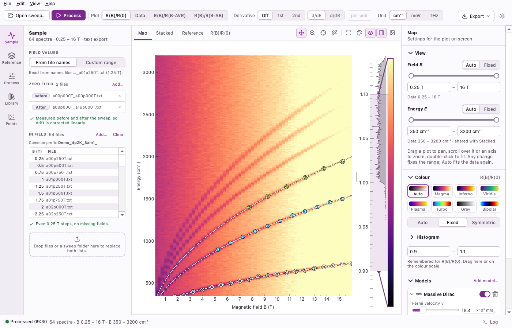
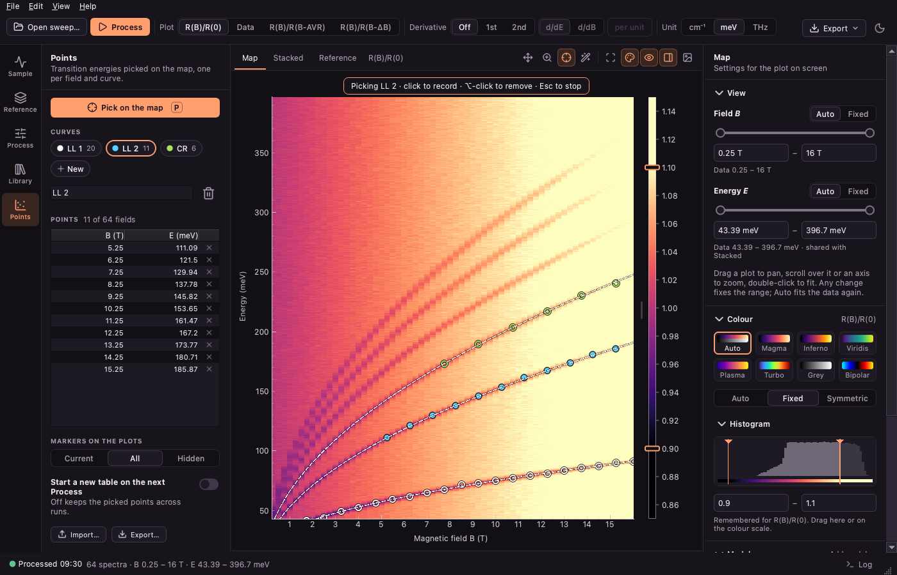
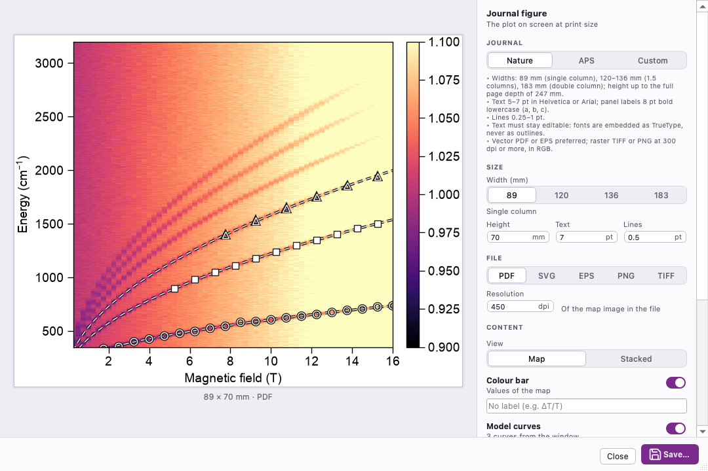

# Magneto-Optical Detective

[](https://github.com/wyzula-jan/mag-opt-detective/actions/workflows/ci.yml)

Desktop tool to plot, pick, fit and export magneto-optical FTIR measurements: field sweeps
recorded with Bruker OPUS, either as OPUS binary files (`*.0`, `*.1`, …) or as two-column
text files written by the OPUS export macro.



*All screenshots show a synthetic Landau fan, drawn by
[`docs/make_screenshots.py`](docs/make_screenshots.py).*

The documentation and download site ([`docs/site`](docs/site)) will be published at
<https://wyzula-jan.github.io/mag-opt-detective/>.

## Features

The window is a workbench: a rail of panels on the left (**Sample**, **Reference**,
**Processing**, **Library**, **Points**), the plots in the middle (**Map**, **Stacked**,
**Reference**), an inspector on the right (**View**, **Colour**, **Traces**, **Models**) and a
log drawer at the bottom. Every side area slides open and closed.

**Load.** Drop a sweep folder or files on the Sample panel (and optionally a reference sweep
on the Reference panel). The fields are read from the file names or set as a custom range;
the panel lists the files by field and reports missing fields. One or two zero-field
spectra (measured before and after the sweep) correct the drift.

**Process** (Ctrl+Return).
- Plots: R(B)/R(0), the data, R(B)/R(B-AVR) (the field average) and R(B)/R(B-ΔB)
  (neighbouring fields).
- 1st or 2nd derivative along energy (d/dE) or field (d/dB), per data point or **per unit**
  (cm⁻¹, meV, THz or T).
- Reference correction with a separate sweep or with the sample itself, smoothed with
  Savitzky–Golay; an energy window and baseline normalisation.
- A dot on Process (and on the Processing panel) shows settings changed since the last run.

**View.**
- **Live energy unit**: the cm⁻¹ | meV | THz switch in the toolbar converts maps, axes,
  ranges, picked points, model parameters and curves, and exports at once, without
  processing again.
- Field, energy and intensity ranges (Auto or Fixed), shared by the map and the stacked
  plot. Colour maps magma, inferno, viridis, plasma, turbo, grey and bipolar, with levels
  Auto (1–99 %), Fixed or Symmetric, remembered per plot kind, and a histogram.
- Colour scales as the classic histogram or a slim bar (a switch in the plot toolbar);
  each one collapses with its handle, or all at once.
- Stacked spectra: offset, every n-th field and colours by field.
- Appearance: light, dark or following the system.

**Pick points** (P). A click on the map records the energy of the current curve at that
field (e.g. a Landau-level transition), Alt-click removes the point. Picking also works on
the stacked plot, by clicking a trace. Curves are chips in the Points panel, with a table of
their points, import and export, and Ctrl+Z / Ctrl+Shift+Z to undo and redo every edit.

**Auto-pick** (W). *Track* follows a clicked line field by field in both directions; *Detect*
finds every line in a dragged box. Options: maxima, minima or rising / falling inflection
points, the search window, Savitzky–Golay smoothing and the prominence. The lines found are
a preview until **Accept** puts them into the current curve (one undo step).

**Models and fitting** (inspector › Models).
- **Massive Dirac** interband transitions (Fermi velocity, half-gap Δ).
- **Zeeman / magnon** branches E₀ + m g μB B, linear or hyperbolic, optionally **coupled**
  by a constant Δᵢⱼ per pair: the energies are the eigenvalues of diag(Eᵢ) + Δ, which gives
  avoided crossings.
- **Custom expressions** in B, one branch per line, with the constants `muB`, `hbar`, `kB`,
  `e`, `c`, `pi` and functions such as `sqrt`, `exp`, `log`; every other name is a parameter
  shared between the lines.
- **Fit to points**: assign each picked curve to a branch (or match the points by energy
  order or to the nearest branch), fit, and read every parameter as value ± σ with χ². The
  results can be copied or saved as a TSV table. Model curves are drawn live and go into
  figure exports.

**Library.** Keep processed maps, load exported tables, cut each to an energy and field
range, then merge spectral ranges, merge field ranges or average repeated sweeps.

**Export.**
- **Data table…** (Ctrl+E): the map shown, tab-separated.
- **Image…** (Ctrl+Shift+E): the journal figure window, with a live preview. Presets
  **Nature**, **APS** and **Custom**: width and height in mm, text and lines in pt, dpi;
  the map or the stacked plot, colour bar, model curves, points and a panel label. Saves
  PDF, SVG and EPS with editable text, and PNG and TIFF.
- **Quick image (PNG/SVG)…**: the plot as on screen, with its colour scale.

Choices (units, ranges, levels, colours, layout) are remembered between sessions;
*View › Reset Settings* restores the defaults.





## Installation

Requires Python ≥ 3.12 and [uv](https://docs.astral.sh/uv/).

```bash
uv sync
```

## Running

```bash
uv run mag-opt-detective
```

or `uv run python -m mag_opt_detective`.

### Without Python

Standalone apps are attached to each
[release](https://github.com/wyzula-jan/mag-opt-detective/releases) (and to every run of the
*App bundles* workflow):

| Archive | Runs on |
| --- | --- |
| `mag-opt-detective-windows.zip` | Windows 10 or 11, 64-bit (x86-64) |
| `mag-opt-detective-macos.zip` | macOS 13 or newer on Apple silicon (no Intel build) |
| `mag-opt-detective-linux.tar.gz` | 64-bit (x86-64) Linux with glibc 2.39 or newer (Ubuntu 24.04, Debian 13, Fedora 40 or newer) |

Unpack it and start `mag-opt-detective` (`.exe` on Windows, *Magneto-Optical Detective.app*
on macOS). The bundles are not code-signed: on macOS right-click the app and choose *Open*
the first time, on Windows choose *More info › Run anyway*.

The first **Image…** export after installing takes about 20 s while matplotlib builds its
font cache. The cache is kept for later sessions in `~/Library/Caches/mag-opt-detective`
(macOS), `%LOCALAPPDATA%\mag-opt-detective` (Windows) or `~/.cache/mag-opt-detective`
(Linux).

Build one yourself (the dev tools stay out of the bundle):

```bash
uv sync --locked --no-default-groups --group bundle
uv run --no-sync pyinstaller packaging/mag-opt-detective.spec --noconfirm
```

`mag-opt-detective --smoke-test` processes a small synthetic measurement, saves a figure in
every format and exits with 0; the workflow runs it on every bundle.

## Input files

| File | Content |
| --- | --- |
| OPUS binary (`*.0`, `*.1`, …) | the single-channel sample spectrum (`ScSm`) is read |
| text (`*.txt`, …) | two whitespace-separated columns: wavenumber (cm⁻¹), intensity |

The file type is detected automatically. With field values **From file names** the field
is taken from the name: `..._a01p250T.txt` → 1.25 T. Files are sorted by field, and the
Sample panel reports missing fields. Otherwise choose **Custom range** and enter start /
step / end.

**Zero field.** Load one zero-field spectrum, or two: measured before and after the
sweep, e.g. `..._a00p000T_a00p000T.txt` and `..._a00p000T_a16p000T.txt`. With two
spectra the zero-field reference is interpolated linearly between the first and the
last field point to compensate drift during the sweep. Files dropped on the Sample or
Reference panel (or a whole sweep folder) are sorted: names whose first field is 0 T go
to the zero-field list.

## Exported files

**Data tables** are tab-separated, compatible with the files written by the old versions,
in the energy unit shown:

```
Energy (meV)	0.25T	0.50T	...
12.5	1.0012	0.9987	...
```

**Point tables** hold field (rows) × curve name (columns), with empty cells for missing
points; the first header cell names the energy unit:

```
Energy (meV)	LL 1	LL 2
0.5	12.398
1.0		24.797
```

Tables without the unit (written before version 5) are read in the unit shown.

**Fit results** (TSV) start with `#` lines (model, curve assignment, number of points, χ²),
then one row per parameter: `parameter`, `value`, `sigma`, `unit`.

**Journal figures** have the exact print size. PDF, SVG and EPS keep their text editable
(TrueType fonts in PDF and EPS, text elements in SVG); PNG and TIFF store the dpi.

## Library

The Library panel keeps processed maps: **Save current map** adds the R(B)/R(0) map
shown, **Load table…** adds exported tables. Tick the maps to combine and open a map's
row to give it an energy (E min / E max, in the energy unit shown) and field (B min /
B max) range; empty limits mean no cut.

- **Merge by energy** joins spectral ranges (e.g. FIR + MIR) and re-grids the energy
  axis to a uniform step.
- **Merge by field** joins field ranges (e.g. 0–8 T and 8–16 T sweeps); fields measured
  twice are averaged.
- **Average** averages repeated measurements with the same field values.

They need at least two ticked maps.

## Keyboard shortcuts

Ctrl is ⌘ and Alt is ⌥ on macOS. *Help › Shortcuts* lists them in the app.

| Keys | Action |
| --- | --- |
| Ctrl+Return (or Ctrl+F) | Process |
| Ctrl+E | Export the shown data as a table |
| Ctrl+Shift+E | Export a journal figure (PDF, SVG, EPS, PNG, TIFF) |
| Ctrl+L / Ctrl+Shift+L | Open sample field / zero-field files |
| Ctrl+R / Ctrl+Shift+R | Load reference field / zero-field files |
| Ctrl+1 / 2 / 3 / 4 | Plot R(B)/R(0) / Data / R(B)/R(B-AVR) / R(B)/R(B-ΔB) |
| Alt+1 / 2 / 3 | No / 1st / 2nd derivative |
| V / Z / P | Pan and zoom / box zoom / pick points |
| W | Auto-pick: follow a clicked line, or find the lines in a dragged box |
| Ctrl+Z / Ctrl+Shift+Z | Undo / redo a point edit (Alt-click removes a point) |
| A | Fit the plot to the data |

## Development

See [CONTRIBUTING.md](CONTRIBUTING.md). In short:

```bash
uv sync
uv run pre-commit install --hook-type pre-commit --hook-type commit-msg
uv run pytest
```

Tests that need real measurement data look for a `Data_to_test/` folder in the
repository root and are skipped when it is missing. Measurement data is never
committed.

## Citing

If you use Magneto-Optical Detective for an analysis in a publication, please cite it.
[`CITATION.cff`](CITATION.cff) has the details (GitHub shows them under *Cite this
repository*), for example:

> J. Wyzula, *Magneto-Optical Detective*, version 5.0,
> https://github.com/wyzula-jan/mag-opt-detective

## Licence

Copyright © 2026 Jan Wyzula.

Magneto-Optical Detective is free software under the [GNU General Public License,
version 3](LICENSE) (GPL-3.0-only): you may use, study, change and share it. What you
share, changed or not, must stay under the same licence and come with its source code.
It comes without any warranty.

To build it into a product that is not released under the GPL, a commercial licence is
available from the author: wyzula.jan@gmail.com.

## Third-party software

The app is built on [Qt](https://www.qt.io) and [PySide6](https://pyside.org) (GNU LGPL
v3), [numpy](https://numpy.org), [scipy](https://scipy.org),
[matplotlib](https://matplotlib.org), [pyqtgraph](https://www.pyqtgraph.org) and
[Pillow](https://python-pillow.org). The icons are [Lucide](https://lucide.dev) icons (ISC
licence, parts MIT), see
[`LICENSE-lucide.txt`](src/mag_opt_detective/gui/icons/LICENSE-lucide.txt). The app bundles
contain every licence text in `THIRD_PARTY_NOTICES.txt`, which *Help › About › Licences…*
also shows.

## History

Versions up to 4.9 were PyQt5 scripts versioned by file name. The last of them is
kept in git under the tag `v4.9-legacy`.
