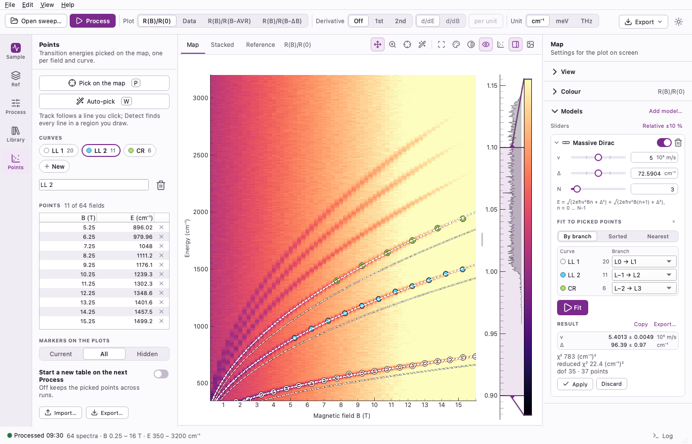

# Docs site

The documentation and download site, to be published at
<https://wyzula-jan.github.io/mag-opt-detective/>. Static HTML, built with the standard library
only.

- `pages/*.html`: one fragment of plain HTML per page, starting with a comment that holds its
  `title` and `description`; `<!-- toc -->` puts an "On this page" list of the `h2` headings
  there, and `<!-- changelog -->` (in `release-notes.html`) the releases of the repository's
  `CHANGELOG.md`, which the build reads (written by `tools/release.py`; "No release yet"
  before the first).
- `layout.html`, `site.css`, `favicon.svg`: the frame around every page and its style.
- `images/`: screenshots of the app, each in the light and the dark appearance
  (`<scene>-light.webp`, `<scene>-dark.webp`, lossless), rendered from a synthetic sweep by
  `python docs/make_screenshots.py` (never from measurement data; see Screenshots).
- `build.py`: puts it together in `_build/` (git-ignored), with the navigation, the docs
  sidebar and previous / next links, and fails on a broken internal link, image or anchor. A
  new page also needs an entry in `MAIN_NAV` or `DOCS` there.

## Screenshots

A page shows the screenshot that matches the reader's appearance: the light image, with the
dark one as a source for a dark appearance. Every `` on a page must be such a pair (the
tests check it), so a picture that is not a screenshot needs another element, such as an
inline SVG.

```html
<figure class="shot">
  <picture>
    <source srcset="images/fit-dark.webp" media="(prefers-color-scheme: dark)">
    
  </picture>
  <figcaption>…</figcaption>
</figure>
```

Captions and alt texts describe the window, never the appearance.

```bash
python docs/make_screenshots.py               # every scene of the site and the README
python docs/make_screenshots.py --scene fit   # one scene (repeat --scene for more)
```

The scenes are listed in `docs/screenshot_list.py`: `SITE` for this folder and `README` for
the README's, which the script copies into `docs/images/`. A new scene needs a name there
and a function in `SCENES` of `docs/make_screenshots.py`. `tests/test_site.py` checks that
every screenshot has its dark twin of the same size and that the image folders hold exactly
these scenes.

## Build

```bash
python docs/site/build.py
```

## Preview

```bash
python -m http.server -d docs/site/_build 8000
```

then open <http://localhost:8000>. All links are relative, so the site works the same under
the project page's `/mag-opt-detective/` path.

## Publish

The *Docs site* workflow (`.github/workflows/pages.yml`) builds and deploys the site to GitHub
Pages. It runs only when started by hand, after Pages is enabled with *GitHub Actions* as the
source.
